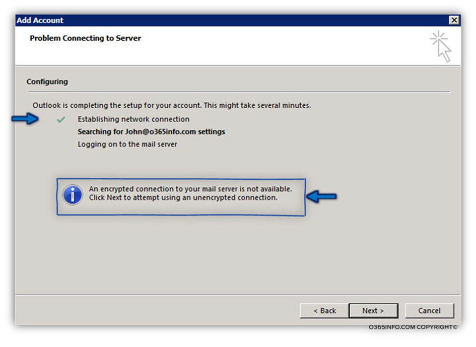

## Table of contents

## Error Details

## Solution

ExcludeLastKnownGoodUrl
Set the Following Registry Key:
HKEY_CURRENT_USER\Software\Microsoft\Office\16.0\Outlook\Autodiscover
DWORD: ExcludeLastKnownGoodUrl
Value: 1
Check that the Following is not set:
HKEY_CURRENT_USER\Software\Policies\Microsoft\Office\16.0\Outlook\Autodiscover
DWORD: ExcludeLastKnownGoodUrl
Value: 1
 
Clear all Identities
Remove everything under HKEY_CURRENT_USER\Software\Microsoft\Office\16.0\Common\Identity\Identities

Select Start, then Windows System, then open the Control Panel and select Credential Manager
Under Windows Credentials remove everything
Restart the PC